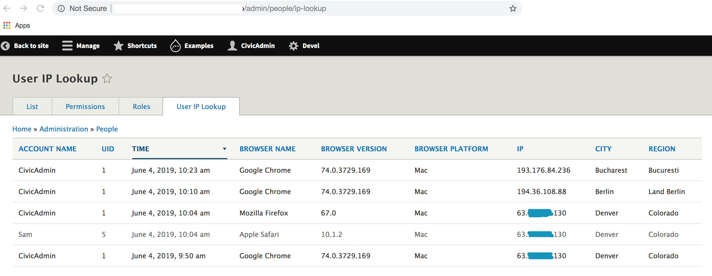

INTRODUCTION
------------

A simple module that tracks each time a user logs in and stores browser name,
platform, browser version, city, region  and user ID into your database.

INSTALLATION
------------

Install, and activate the module as you would any other module.

CONFIGURATION
-------------

Go to configration page: https://example.com/admin/config/ip-lookup/settings.

Put ipdata API key into the form and save configuration.(default key is test)

You can get ipdata API key from [https://ipdata.co](https://ipdata.co/).

Ipdata provide a fast, highly available IP Geolocation API with
reliable performance.

Default ipdata test key will let you lookup few ip Geolocation.

User IP Lookup table links  https://example.com/admin/people/ip-lookup. 

REQUIREMENTS
-------------

No special requirements.
